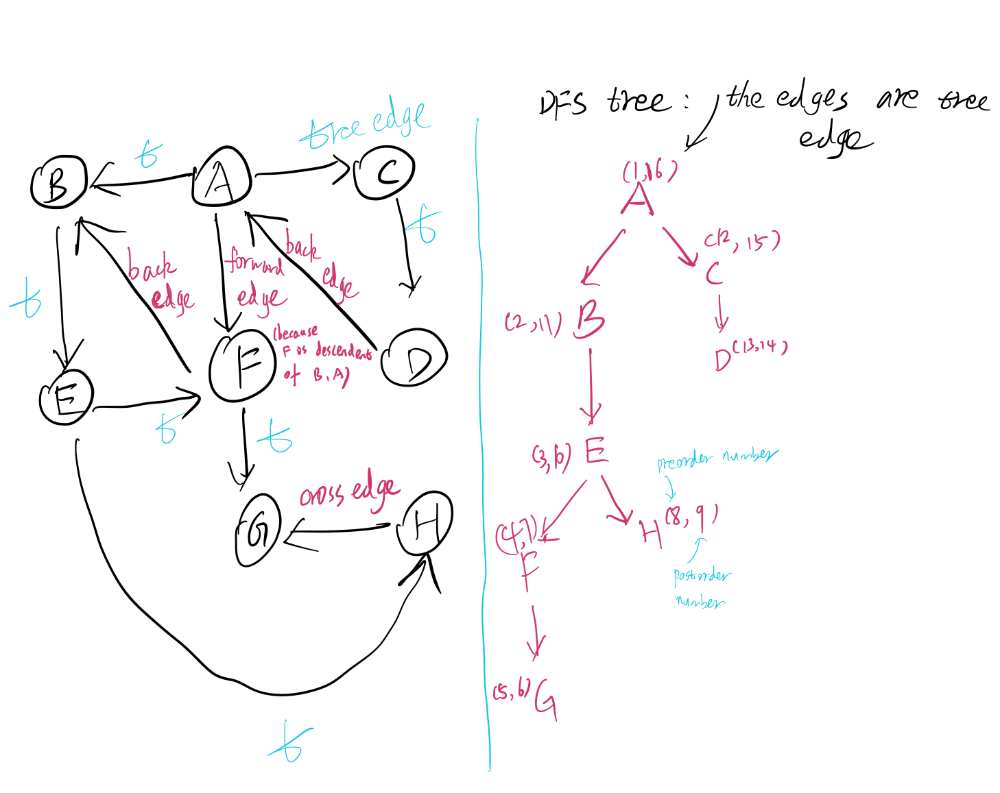

# lec5 Decompositions of graphs

Graph is a pair G=\(V,E\), V means 'vertices', E means 'edges'

Directed Graph: $$E \subseteq V \times V$$\(if \(a,a\) is not allowed, we call the graph 'simple'\) Undirected: E is a set of unordered pairs from V

Examples: 1. Road network, vertices are intersections. Edges are road segments connecting intersections.\(If you want to represent a one way road then it's directed, otherwise it's undirected.Also maybe weighted\) 2. Social networks. Twitter/IG:directed, FB:undirected

## Represent graph to computer

Vertices V={1,...,n}.

Edges

* Adjacency Matrix E={}
* Adjacency List


## Running algorithms on graphs

### Graph exploration\(Depth first search DSF\)

```text
def DFS(V,E):
    global clock=1
    global visited=boolean[n](initiate to all False)
    global preorder/post order =  int[n]
    for v in V:
        if !visited[v]:
            explore(v)
```

```text
def explore(v):
    visited[v] = True
    preorder[v] = clock++
    for (v,w):
        if !visited[w]:
            explor(w) 
    postorder[v]=clock++
```

preorder and postorder are just arrays.


### DFS   Runtime

Total $$\Theta(n)+\sum_{u\in V}(\text{time to enumerate neighbors of u})$$

Adj matrix: $$\Theta(n^2)$$

Adj list: $$\Theta(n)+\Theta(\sum_{u\in V}d_u)=\Theta(n+m),d_u$$ is the degree of u.

### DFS application

* reachability, identifies connected components
* articulation points\(set of vertices whose removal would disconnect graph\)
* finding biconnected\(at leaste two paths between two vertices and they don't share middle vertices\)/triconnected components.
* strongly connected components\(get from A to B also from B to A\) 
* planarity testing
* isomorphism of cleaner graphs

### Claim

the set of intervals \[preorder\(u\), postorder\(n\)\] are pairwise nested or disjoint. There will never be intersection!\(Think about the way we do DFS\)

### Types of edges in graph

* tree edge: traversed during the DFS
* forward edge: goes from an ancestor to a descendant in DFS, and is not a tree edge
* back edge:
* goes from a descendent to an ancestor in DFS tree
* cross edge: all other edges of the Graph
* Claim: post\(u\) &lt;= post\(v\) iff \(u,v\) is a back edge 
* Claim: G is cycle iff exists a back edge



