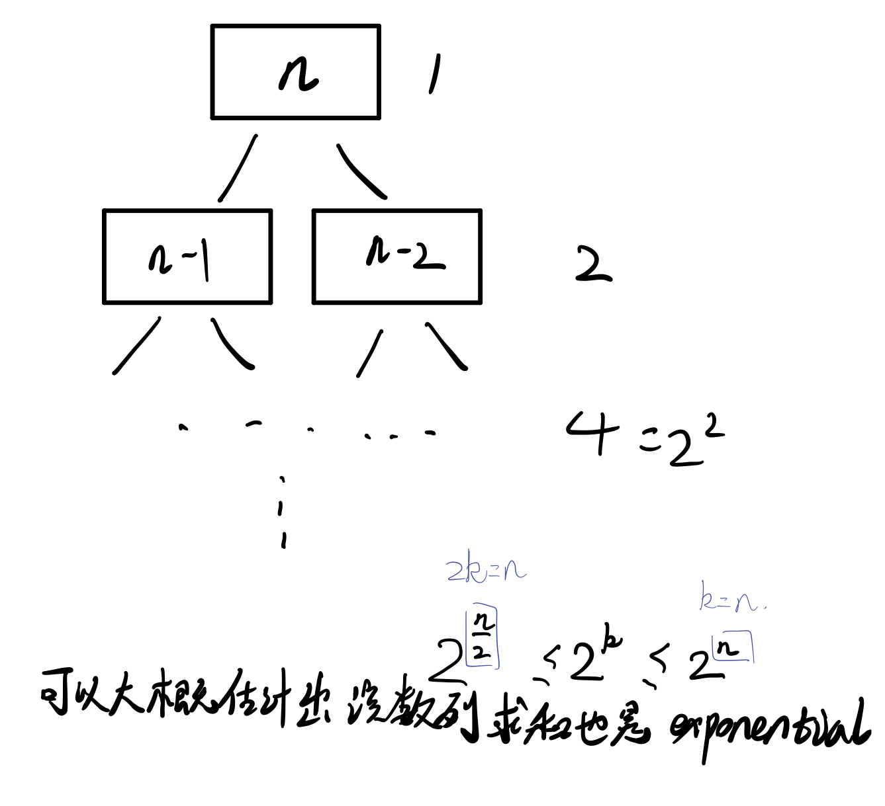
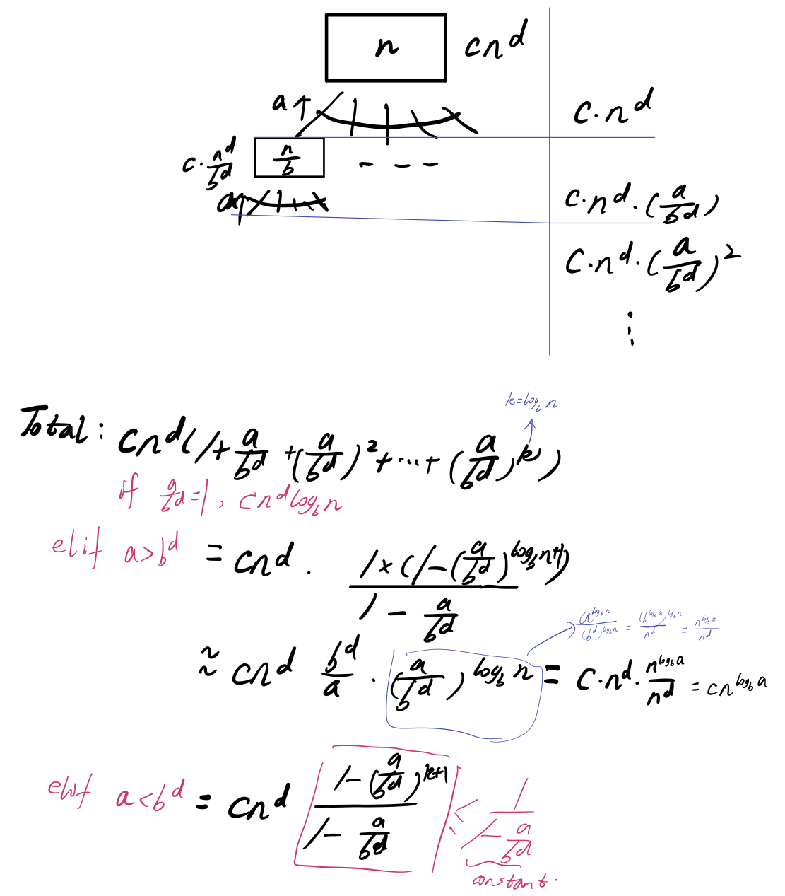

# lec2

## 1. More Arithmetic

Algorithms for computing: Fibonacci numbers.$$F_0 = 0, F_1 = 1,\dots ,F_n = F_{n-1} + F_{n-2}, n > 1$$. Design algorithm to compute Fibonacci numbers. _Flop_ = Floating Point Operation: addition, subtraction, multiplication, division.

### 1. Alg 1: Recursion

```text
def FibRec(n):
    if n <= 1: return n
    else: return FibRec(n-1) + FibRec(n-2)
```
Addition is the only flop in this algorithm.
Let $$T(n)=$$ #flops to compute $$F_n$$.
$$T(n)=\begin{cases}
    0, n\leq 1\\
    T(n-1) + T(n-2) + 1, n > 1
\end{cases}$$
$$F_n = F_{n-1} + F_{n-2} \geq 2\cdot F_{n-2} \geq 2^2\cdot F_{n-2\cdot2} \geq 2^{\frac{n}{2}}$$. For the same reason $$F_n \leq 2^n$$. The number of flops is exponential, see figure below for procedure to compute it.


### 2. Alg 2: Iteration

```text
def FibIter(n):
    if n <= 1: return n
    a  = 0
    b = 1
    for i = 1 to n - 1:
        tmp = b
        b = a + b
        a = tmp
    return b
```
Addition is the only flop. And number of flops is $$\Theta(n)$$.

### 3. Alg 3: Fast Matrix Powering

$$
\begin{bmatrix}
    1 & 1\\
    1 & 0
\end{bmatrix} \begin{bmatrix}
    F_n \\
    F_{n-1}
\end{bmatrix} = \begin{bmatrix}
    F_{n+1} \\
    F_n
\end{bmatrix}
$$
So $$\begin{bmatrix}F_{n+1}\\
    F_n\end{bmatrix} = A^n\begin{bmatrix}1 \\0 \end{bmatrix}$$

For example we want to compute $$9^{71}$$. Computer the following sequence first,
$$9^1, 9^2, 9^4, 9^8, 9^{16}, 9^{32}, 9^{64}$$
$$71 = 64 + 4 + 2 + 1$$.
Total need $$<= 2 \cdot \log_2{n}$$ flops. Because we need $$\log_2{n}$$ times multiplication and at most need  $$\log_2{n}$$ times addition to get the final result. So $$O(\log n)$$ flops for matrix powering.


### 4. Alg 4: closed form solution(will never quiz me on)
$$A = Q \Lambda Q^T, Q^TQ = QQ^T = I, \Lambda = \begin{bmatrix}
    \lambda_1 & 0 \\
    0 & \lambda_2
\end{bmatrix}$$
$$
A^n = Q\Lambda^nQ^T
$$
$$\phi = \frac{1+\sqrt{5}}{2}, \psi = \frac{1-\sqrt{5}}{2}, Q = \begin{bmatrix}
    \sqrt{\phi} & -\sqrt{-\psi}\\
    \sqrt{-\psi} & \sqrt{\phi}
\end{bmatrix}, \lambda_1 = \phi, \lambda_2 = \psi\\
F_n = \frac{1}{\sqrt{5}}(\phi^n - \psi^n)$$.
We can use fast powering to do the exponentiation, so in terms of flops it's likely no better than Alg 3.

### 5. Summary
Suppose we have a number $$t$$, it takes $$\log t$$ digits to write this number down.[This is because $$\log_{10}t + 1$$ is its number of digits.] Since $$2^{\frac{n}{2}}\leq F_n \leq 2^n$$, we need $$c\log 2^n = c n$$ digits to write it down.
| Alg | # flops | Runtime |
| ---- | ---- | ---- |
| Recursion | exp(cn) addition[takes number of digits n]|  exp(cn)n|
| Iteration | nc addition|$$1+2+\cdots+n \approx n^2$$[Since $$F_n$$ has approximately n digits]  |
| Fast Mat Pow|log n multiplication|$$n^2\log n$$[$$\log n$$ multiplication, and big number has almost $$n$$ digits.] Of course $$n^2$$ can be smaller. e.t. Karatsuba.|
|closed form|log n|ignore this|
## 2. Asymptotic Notation
* "Big-Oh": $$f=O(g)$$ if $$\exist c > 0, \forall n,f(n) \leq c\cdot g(n)$$.
* "Little-oh" $$f=o(g)$$ means $$\lim_{n\rightarrow \infty}\frac{f(n)}{g(n)}$$
* "Big-Omega": $$f=\Omega(g)$$ if $$g = O(f)$$.
* "Little-Omega": $$f=\omega(g)$$ if $$g = o(f)$$.
* "Theta": $$f=O(g),f=\Omega(g)$$

## 3. Preview of next topic(Divide and Conquer)
Master Theorem: Solves recurrences of form. $$T(n)=aT(\frac{n}{b})+cn^d$$(Karatsuba: $$a=3,b=2,d=1$$).


|$$\frac{a}{b^d}$$|runtime|
|----|----|
|=1|$$n^d\log n$$|
|>1|$$n^{\log_ba}$$|
|<1|$$n^d$$|