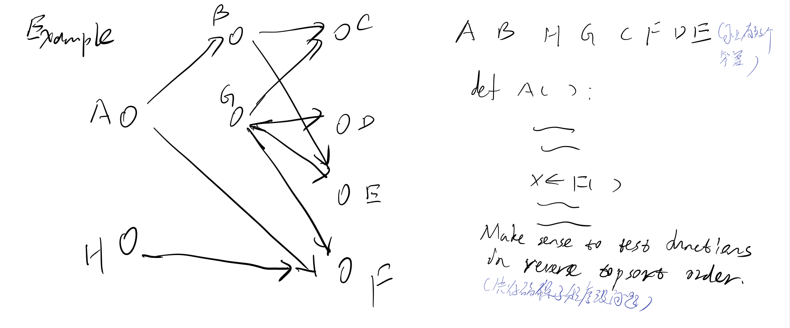
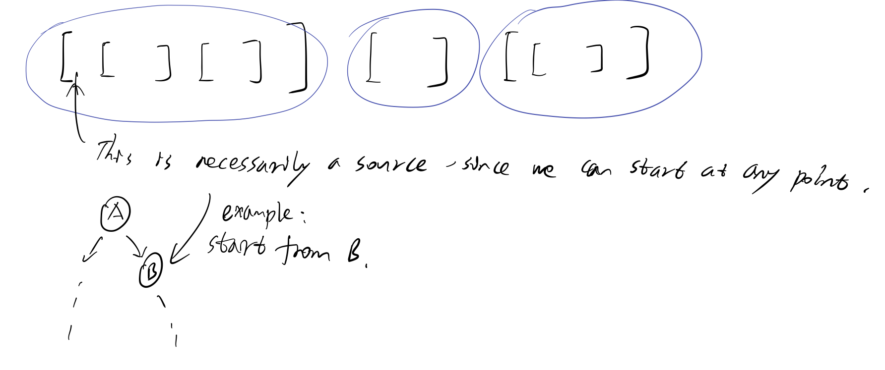
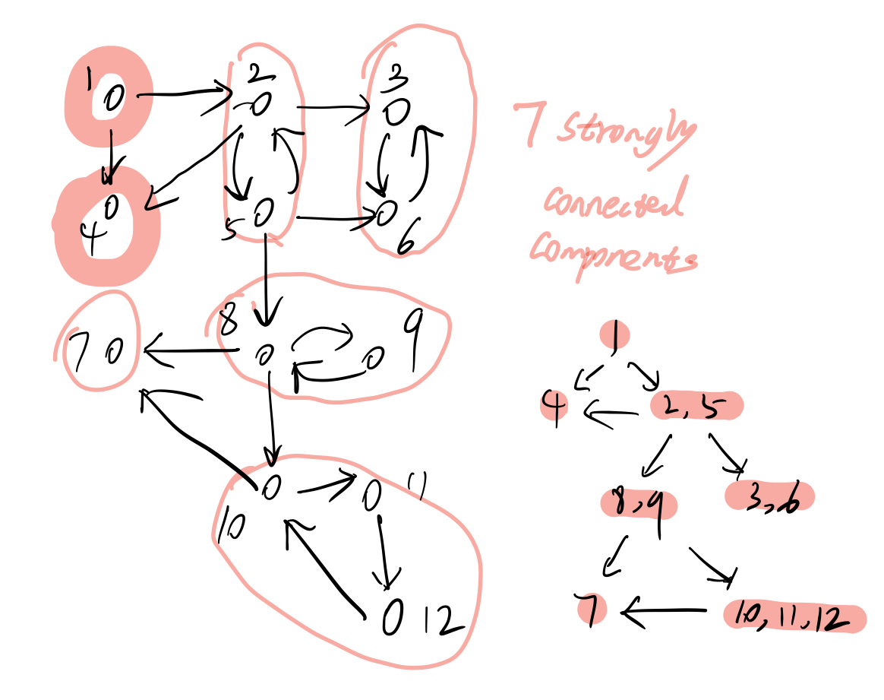
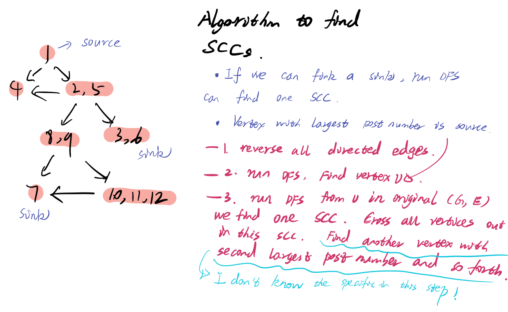

# lec6 Paths in graphs \(Part I\)

## Topological Sort
Input is a "DAG"(Directed Acyclic Graph)Acyclic means no cycles

Goal: output an ordering of V s.t. (u,v) in E we have u must come before v in ordering.



### Alg1

```text
Brute force search.
Try all permutations of v
return first one that is a topological sort
```
Runtime: n!mn(check all possible situation and check  vertices, check edge)

### Alg2
source means no in edges and sink means no outgoing edges
```text
iteratively peel off source vertices one at a time
Can be done in O(m+n) time with arrays and doubly linked lists
```

### Alg3
If we know the pre and post number of the graph.



Claim: vertex v with largest post(v) value must be a source.[detail proof in lec6 recording]


## Strongly Connected Components(SCC)
u,v are strongly connected if u has a path to v and vice verse or it's a maximal subset of strongly connected vertices.



Claim: SCC graph is a DAG(If it's not we can merge them into a SCC, so it's apparent)

### Alg1
Do n DFS's one from each vertex

O(n(n+m)+n^2) = O(mn+n^2)
n times DFS, and scan the whole array takes n^2.

### Alg2




## Preview of BFS