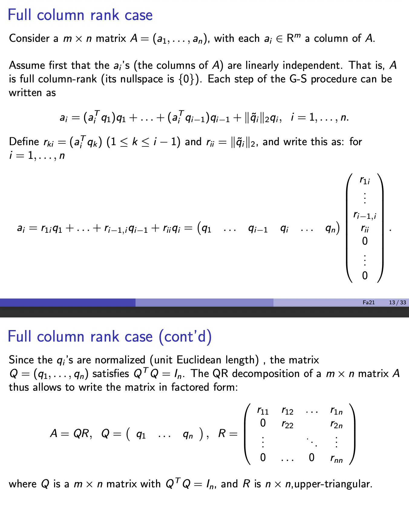
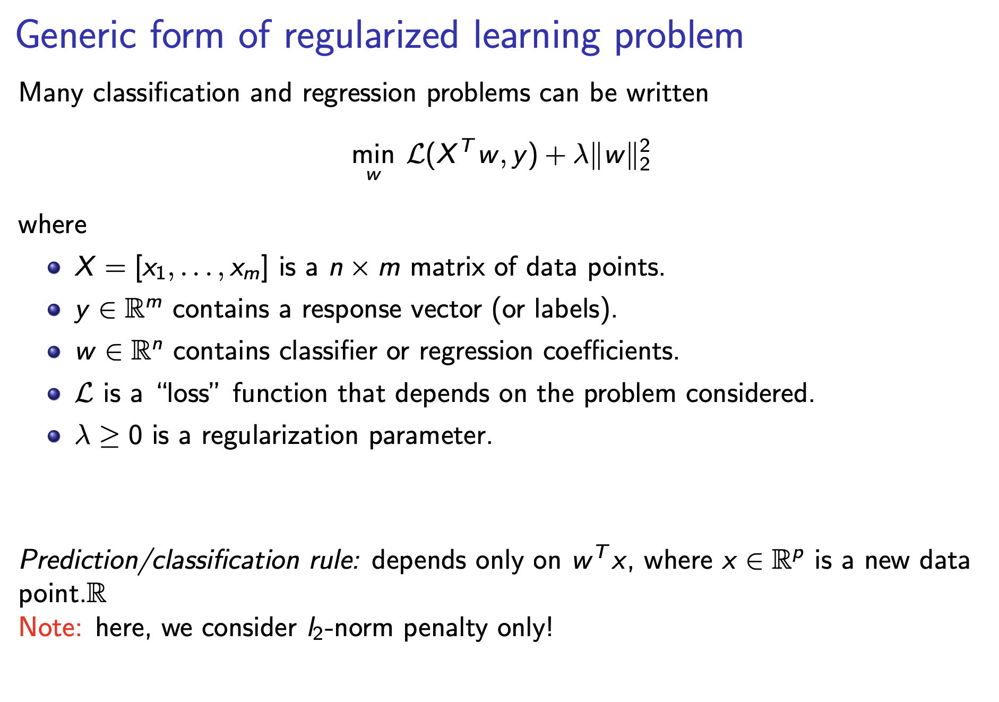

# lec4:ortho QR kernels

## Ortho
already mentioned in [linear-algebra-review](linear-algebra-review.md)

## QR decomposition
The QR decomposition is nothing else than the Gram-Schmidt procedure applied to the columns of the matrix, and with result expressed in matrix form.

## Kernels

For the generic problem:

$$\min_{\omega} \mathcal{L}(X^T \omega, y) + \lambda ||\omega||_2^2$$

the optimal $$\omega$$ lies in the span of the data points $$(x_1, \dots, x_m)$$ :
$$\omega = Xv$$
for some vector $$v \in \mathbb{R}^m$$

Proof:
For any matrix $$X \in \mathbb{R}^{n \times m}$$ every $$\omega \in \mathbb{R}^n$$ can be written as the sun of two orthogonal vectors, one in the range of $$X$$ and the other orthogonal to it:

$$\omega = Xv + r$$

where $$v \in \mathbb{R}^m, X^T r = 0$$

Since $$X^T \omega = X^T Xv + X^Tr = X^T Xv$$ the optimal $$\omega$$ can be written as $$\omega = Xv$$

Hence training problem depends only on the $$m \times m$$(PSD) matrix $$K := X^T X$$:

$$\min_{v} \mathcal{L}(Kv,y)+\lambda v^T K v$$

### Quadratic kernels

Classification with quadratic boundaries involves feature vectors

$$\phi(x) := (1, x_1, x_2, x_1^2, x_1x_2,x_2^2) $$

Modified kernel matrix

$$K_{ij} = \phi(x_i)^T \phi(x_j), 1\leq i, j\leq m$$

**Important** given two vectors $$x,z \in \mathbb{R}^2$$ we have

$$\phi(x)^T\phi(z)=(1+x^Tz)^2$$

### Polynomial kernels

More generally when $$\phi(x)$$ is the vector formed with all the products between the components of $$x \in \mathbb{R}^n$$ up to degree $$d$$ then for any two vectors $$x, z \in \mathbb{R}^n$$

$$\phi(x)^T \phi(z) = (1+x^T z)^d$$

**Computational effort grows linearly in $$n$$**

### Gaussian kernel function

$$k(x,z) = \exp(-\frac{||x-z||_2^2}{2\sigma^2})$$

Corresponds to a non-linear mapping $$\phi$$ to infinite-dimensional feature space.