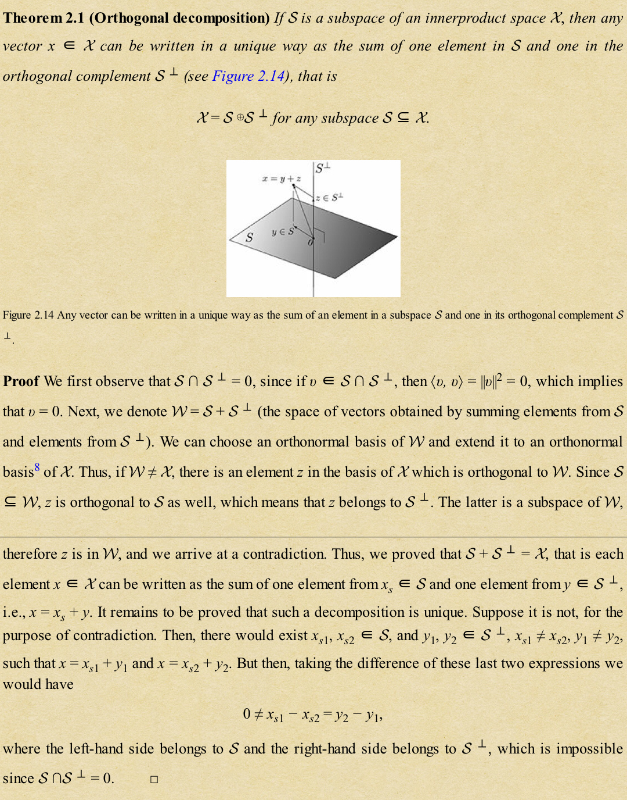

# Matrices

## Matrix-vector product

Let $$A \in \mathcal{R}^{m,n}$$ be a matrix with columns $$a_1, \dots, a_n \in \mathcal{R}^m$$
and $$b\in R^{n}$$ a vector. We define the matrix-vector product by
$$Ab = \sum_{k=1}^n a_k b_k$$

Similarly, we can multiply matrix $$A\in R^{m,n}$$ on the left by (the transpose of) vector $$c\in \mathcal{R}^m$$ as follows
$$c^T A = \sum_{k=1}^m c_k \alpha_k^T, A\in \mathcal{R}^{m,n},c\in \mathcal{R}^{m}$$.
Though it's not easy to see why this is the case, we can derive this as follows:
$$A^Tc = \sum_{k=1}^m c_k\alpha_k \Rightarrow c^T A = \sum_{k=1}^m c_k \alpha_k^T$$

## Matrix product

$$AB = \begin{bmatrix}
    \alpha_1^T\\
    \vdots\\
    \alpha_m^T
\end{bmatrix}B = \begin{bmatrix}
    \alpha_1^T B\\
    \vdots\\
    \alpha_m^T B
\end{bmatrix}$$
$$AB = A\begin{bmatrix}
   b_1 & \dots & b_p 
\end{bmatrix}=\begin{bmatrix}
    Ab_1 & \dots & Ab_p
\end{bmatrix}$$

$$AB = \sum_{i=1}^n \alpha_i \beta_i^T$$
$$\beta_i^T$$ denote the rows of $$B$$, this is the sum of *dyadic* matrices and is not easy to detect at first glance, but it's a reasonable representation.

For any two conformably sized matrices $$A, B$$, it holds that $$
(AB)^T = B^T A^T$$

## Range, rank, and nullspace

The range of $$A$$ is denoted $$\mathcal{R}(A)$$:
$$
\mathcal{R}(A) = {Ax:x\in \mathbb{R}^n}
$$
The range is a subspace. The dimension of $$\mathcal{R}$$ is called the *rank* of A and denoted with rank(A); by definition the rank represents the number of linearly independent columns of A.

The nullspace of $$A \in \mathbb{R}^{m,n}$$ is the set of vectors in the input space that are mapped to zero, and is denoted $$\mathcal{N}(A) = {x \in \mathbb{R}^n: Ax = 0}$$
This set is again a subspace.

$$\mathcal{R}(A^T), \mathcal{N}(A)$$ are mutually orthogonal subspace, i.e., $$\mathcal{N}(A) \bot \mathcal{R}(A^T)$$.
The direct sum of a subspace and its orthogonal complement equals the whole space, thus,
$$\mathbb{R}^n = \mathcal{N}(A) \oplus \mathcal{R}(A^T)$$.

## Fundamental theorem of linear algebra.

For any given matrix $$A \in \mathbb{R}^{m,n}$$
$$\mathcal{N}(A) \oplus \mathcal{R}(A^T) = \mathbb{R}^n$$
$$\mathcal{R}(A) \oplus \mathcal{N}(A^T) = \mathbb{R}^m$$

Consequently, we can decompose any vector $$x \in \mathbb{R}^n$$ as the sum of two vectors orthogonal to each other, one in the range of $$A^T$$, and the other in the nullsapce of $$A$$:
$$x = A^T \xi + z, z \in \mathcal{N}(A)$$

Similarly, we can decompose any vector $$w \in \mathbb{R}^m$$ as the sum of two vectors orthogonal to each other, on in the range of $$A$$, and the other in the nullspace of $$A^T$$:
$$w = A \varphi + \zeta, \zeta \in \mathcal{N}(A^T)$$.

### proof
For any $$x \in \mathcal{R}(A^T)$$, and any $$z\in \mathcal{N}(A)$$, it holds that $$x^T z = 0$$. Because every $$x \in \mathcal{R}(A^T)$$, it can be written as $$x = A^T y$$ for some $$y \in \mathbb{R}^m$$. Hence,
$$x^T z = (A^Ty)^T z = y^T Az = 0, \forall z \in \mathcal{N}(A)$$.
Thus $$\mathcal{R}(A^T)$$ and $$\mathcal{N}(A)$$ are mutually orthogonal subspace. With a similar reasoning, we also argue that $$\mathcal{R}(A) \bot \mathcal{N}(A^T)$$

## Determinants

$$\operatorname{det}(A) = \sum_{j=1}^n(-1)^{i+j}a_ij \operatorname{det}A_{(i,j)}$$

$$A \in \mathbb{R}^{n,n}$$ is singular $$\Leftrightarrow \mathcal{N}(A)$$ is not equal to $${0}$$.

For any square matrices $$A, B \in \mathbb{R}^{n,n}$$ and scalar $$\alpha$$:

$$\operatorname{det}A = \operatorname{det}A^T$$
$$\operatorname{det}AB = 
\operatorname{det}BA = \operatorname{det}A \operatorname{det}B$$
$$\operatorname{det}\alpha A = \alpha^n \operatorname{det}A$$.
Here is a intuitive way to understand determinant:
[3b1b](https://www.youtube.com/watch?v=Ip3X9LOh2dk&list=PLZHQObOWTQDPD3MizzM2xVFitgF8hE_ab&index=6)

## Eigenvalues/eigenvectors

To each distinct eigenvalue $$\lambda_i, i = 1, \dots, k$$, there corresponds a whole subspace $$\phi_i \dot = \mathcal{N}(\lambda_i I_n - A)$$ of eigenvectors associated to this eigenvalue called the *eigenspace*.

## Matrix factorizations

Orthogonal-triangular decomposition(QR). Any square $$A \in \mathbb{R}^{n,n}$$ can be decomposed as 
$$A = QR$$,
where $$Q$$ is an orthogonal matrix, and $$R$$ is an upper triangular matrix.

Singular value decomposition(SVD). Any non-zero $$A \in \mathbb{R}^{m,n}$$ can be decomposed as 
$$A = U\tilde{\Sigma} V^T$$
where $$V \in \mathbb{R}^{m,m}$$ are orthogonal matrices, and
$$\tilde{\Sigma} = \begin{bmatrix}
    \Sigma & 0_{r,n-r}\\
    0_{m-r,r} & 0_{m-r,n-r}
\end{bmatrix}, \Sigma = \operatorname{diag}(\sigma_1,\dots,\sigma_r)$$
r is the rank of A, and the scalars $$\sigma_i > 0, i = 1, \dots, r$$ are called the singular values of A.

I should post proof here.(from the text book)