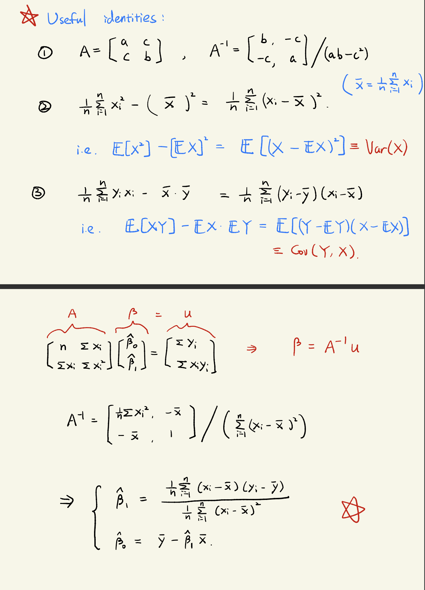
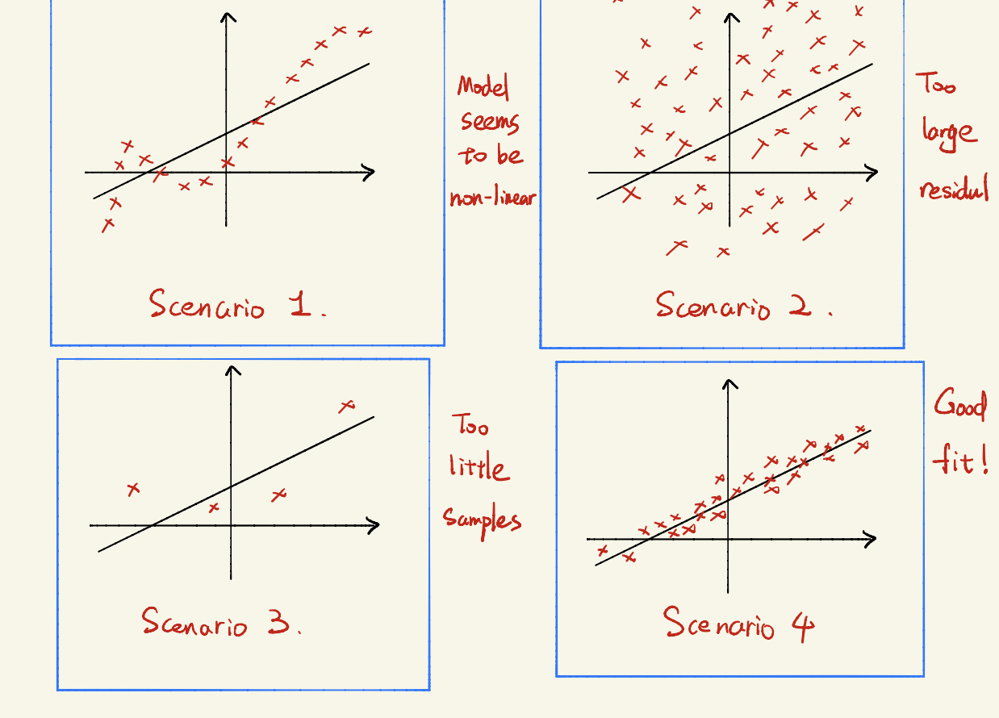

# lec3 Linear Regression I

Questions:

1. Is there a relationship between advertising budget and sales?

2. How strong is the relationship between advertising budget and sales?

3. Which media are associated with sales?

4. How large is the association between each medium and sales?

5. How accurately can we predict future sales? Is the relationship linear?
6. Is there synergy among the advertising media?

Statistical tools to answer these questions:

1. Parameter estimation
2. Confidence interval
3. Parameter hypothesis testing
4. Model assessment
   
## Simple linear regression

$$Y = \beta_0 + \beta_1 x + \epsilon, \epsilon \sim \mathcal{N}(0, \sigma^2)$$

Assumption maybe wrong, If assumptions correct, how to learn $$\beta_0,\beta_1$$ ?

*residuals*:$$e_i = y_i - \beta_0 - \beta_1 x_i$$
*Residual sum of square*: $$RSS(\beta_0,\beta_1) = \sum_{i=1}^n e_i^2 = \sum_{i=1}^n(y_i - \beta_0  - \beta_1 x_i)^2$$

$$(\hat{\beta_0},\hat{\beta_1})=\text{argmin}_{\beta_0,\beta_1} \text{RSS}(\beta_0,\beta_1)$$.

### Why we do this?(MLE)

Maximum Likelihood Estimator!

The likelihood function of $$(x_i,y_i)_{i \in [n]}$$.

$$
\begin{aligned}
L(\beta_0, \beta_1) &= \prod_{i=1}^n \frac{1}{\sqrt{2 \pi}\sigma} e^{-\frac{(y_i - \beta_0 - \beta_1 x_i)^2}{2\sigma^2}} \\
&= \frac{1}{\sqrt{2\pi}^n \sigma^n}e^{-\sum_{i=1}^n {-\frac{(y_i - \beta_0 - \beta_1 x_i)^2}{2\sigma^2}}}
\end{aligned}
$$

$$(\hat{\beta_0},\hat{\beta_1})=\text{argmin}_{\beta_0,\beta_1} L(\beta_0,\beta_1) \Rightarrow (\hat{\beta_0},\hat{\beta_1})=\text{argmin}_{\beta_0,\beta_1} \text{RSS}(\beta_0,\beta_1)$$.

$$\partial_{\beta_0}\text{RSS}(\beta_0, \beta_1) = -2\sum_{i=1}^n(y_i - \beta_0 \beta_1 x_i)=0$$
$$\partial_{\beta_1}\text{RSS}(\beta_0, \beta_1) = -2\sum_{i=1}^n(y_i - \beta_0 \beta_1 x_i)x_i=0$$

## Model assessment(Is this a good prediction?)

Suppose $$\hat{\beta_0} = 1, \hat{\beta_1} = 0.5\Rightarrow y = 1 + 0.5x$$

Questions:
1. How confident for saying $$\beta_1 = 0.5$$ ?
Confident interval for $$\beta_1$$ .
2. Do we need $$x$$ to predict $$y$$?
Testing whether $$\beta_1 = 0$$ : t-test
3. Does $$x$$ well-explain $$y$$ ?
Testing whether model is good enough: $$R^2$$  statistics.

### Confidence interval

Intuition: Gaussian mean estimation.

$$z_1 \dots, z_n \sim_{\text{iid}} \mathcal{N}(\mu, \sigma^2) \Rightarrow \hat{\mu} = \bar{z} = \frac{\sum_{i=1}^n}{z_i},\operatorname{Var}(\hat{\mu}) = \frac{\sigma^2}{n}, \operatorname{SE}(\hat{\mu})=\frac{\sigma}{\sqrt{n}}$$ .

$$95\%$$ confidence interval: