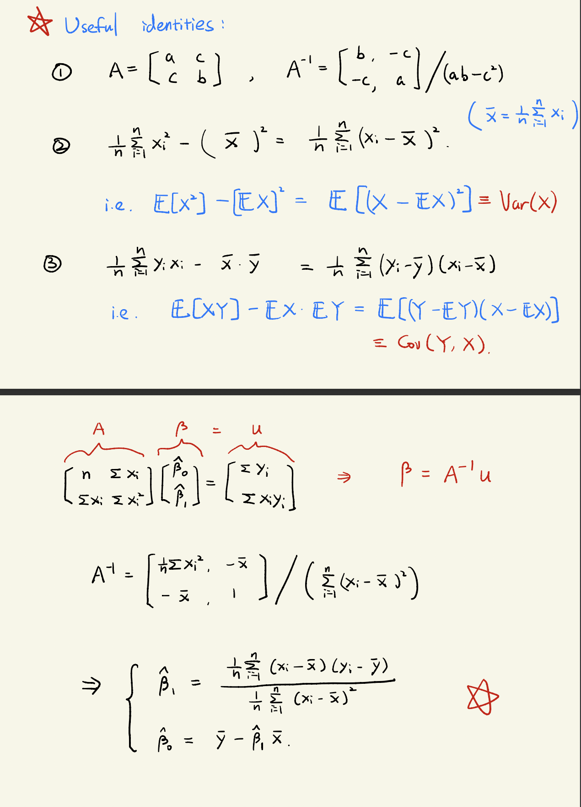
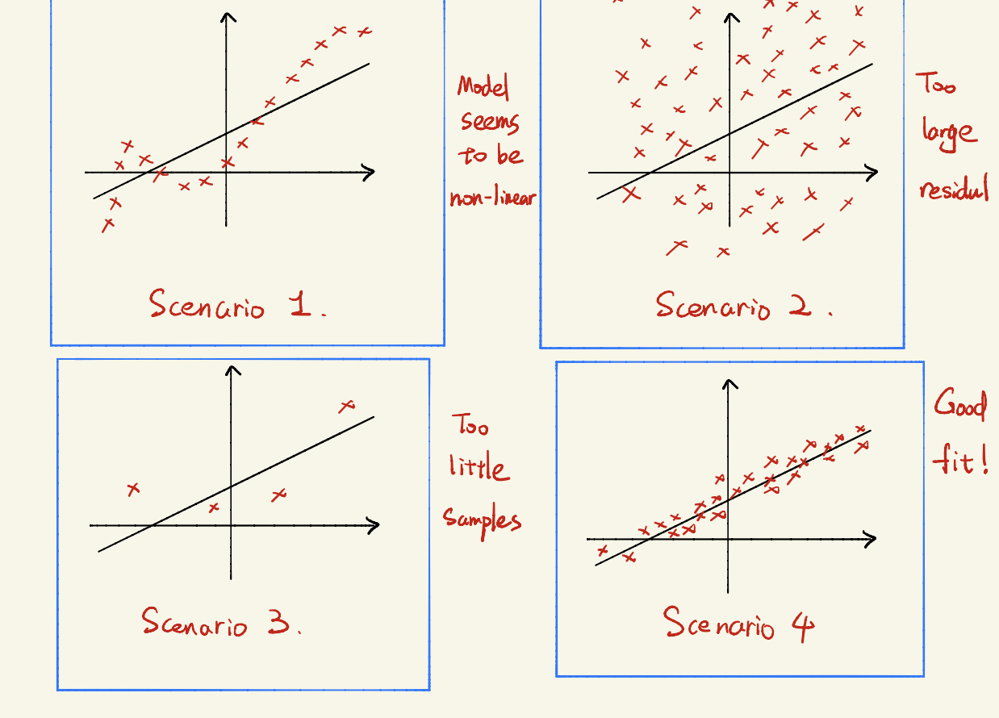
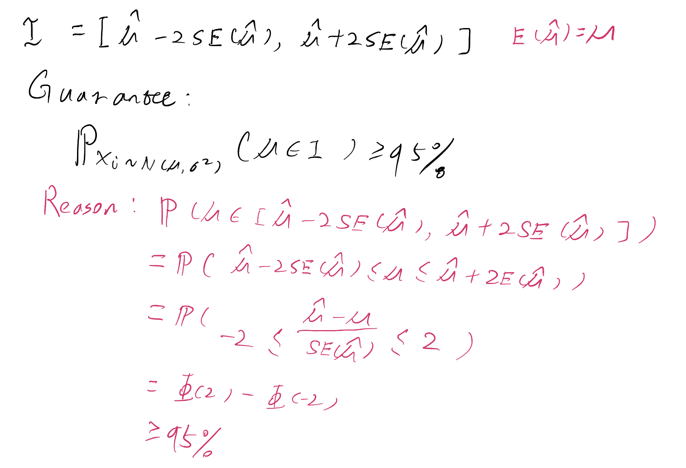
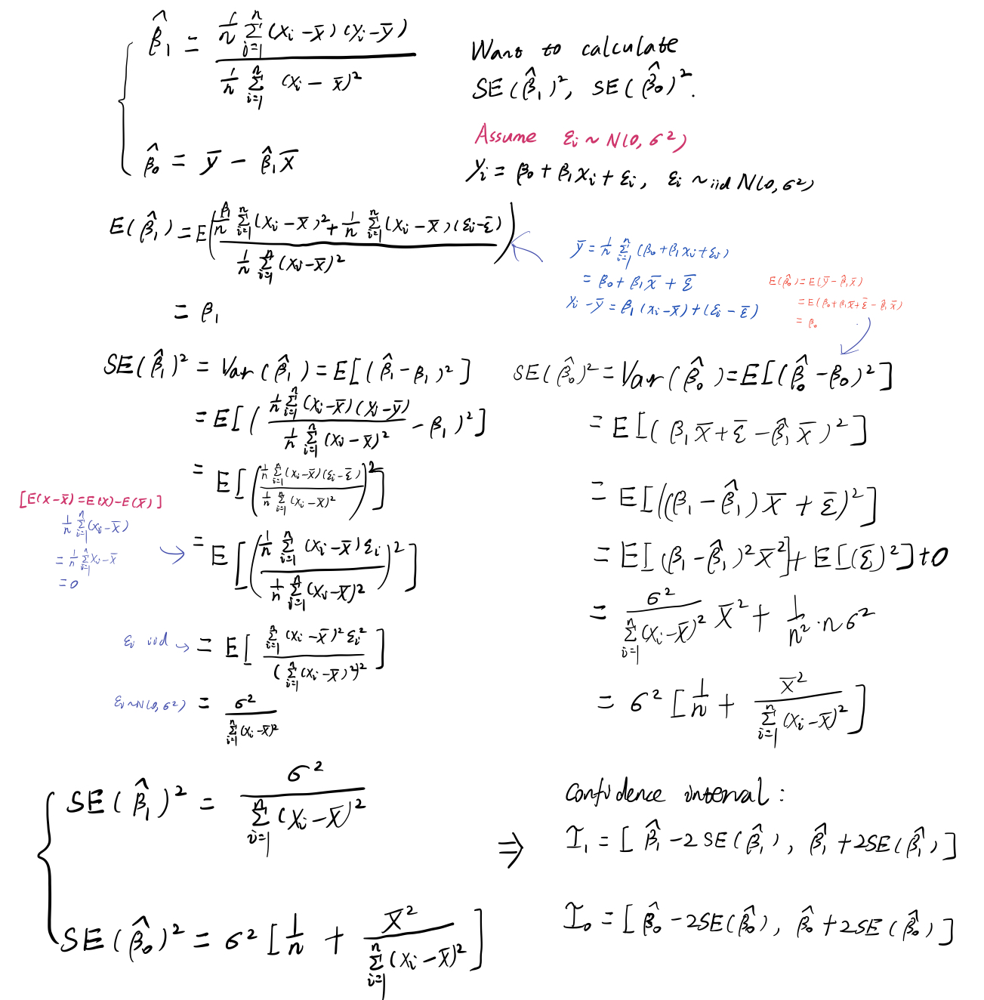
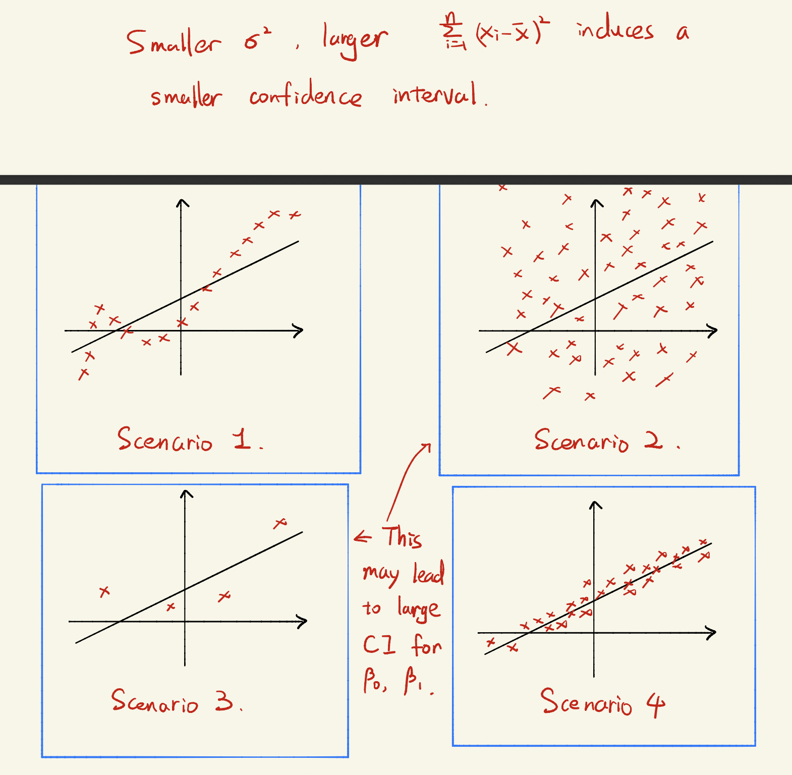
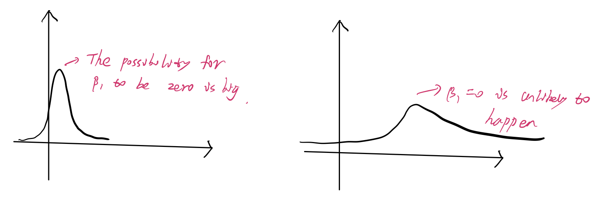
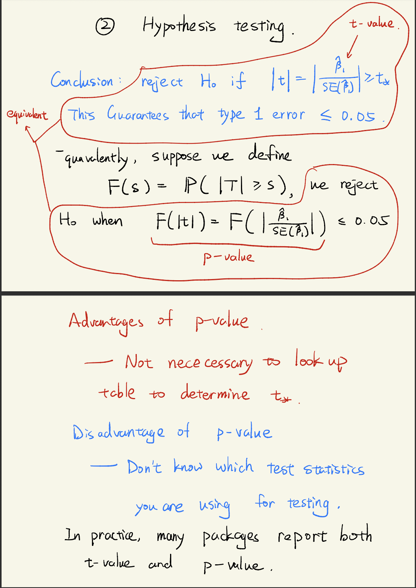
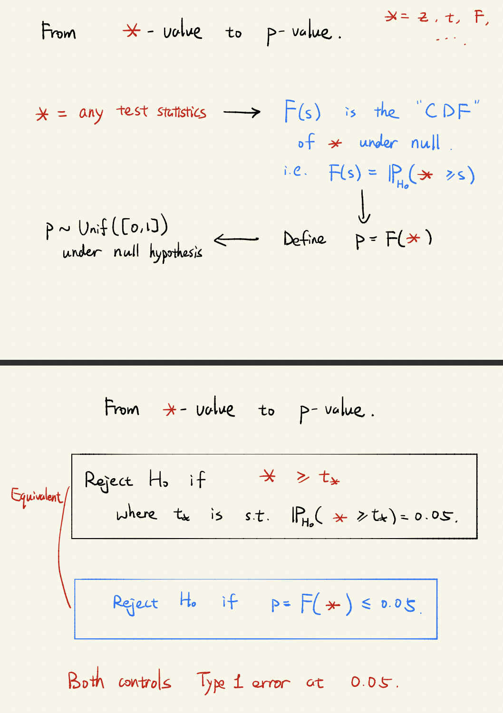
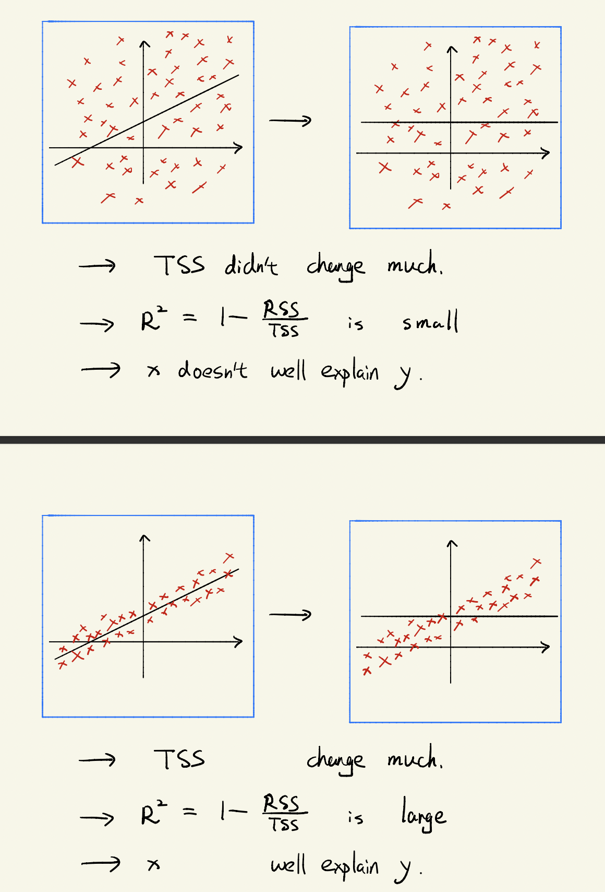

# lec3 Linear Regression I

Questions:

1. Is there a relationship between advertising budget and sales?
2. How strong is the relationship between advertising budget and sales?
3. Which media are associated with sales?
4. How large is the association between each medium and sales?
5. How accurately can we predict future sales? Is the relationship linear?
6. Is there synergy among the advertising media?

Statistical tools to answer these questions:

1. Parameter estimation
2. Confidence interval
3. Parameter hypothesis testing
4. Model assessment

## Simple linear regression

$$Y = \beta_0 + \beta_1 x + \epsilon, \epsilon \sim \mathcal{N}(0, \sigma^2)$$

Assumption maybe wrong, If assumptions correct, how to learn $$\beta_0,\beta_1$$ ?

_residuals_:$$e_i = y_i - \beta_0 - \beta_1 x_i$$ _Residual sum of square_: $$RSS(\beta_0,\beta_1) = \sum_{i=1}^n e_i^2 = \sum_{i=1}^n(y_i - \beta_0 - \beta_1 x_i)^2$$

$$(\hat{\beta_0},\hat{\beta_1})=\text{argmin}_{\beta_0,\beta_1} \text{RSS}(\beta_0,\beta_1)$$.

### Why we do this?\(MLE\)

Maximum Likelihood Estimator!

The likelihood function of $$(x_i,y_i)_{i \in [n]}$$.

$$
\begin{aligned}
L(\beta_0, \beta_1) &= \prod_{i=1}^n \frac{1}{\sqrt{2 \pi}\sigma} e^{-\frac{(y_i - \beta_0 - \beta_1 x_i)^2}{2\sigma^2}} \\
&= \frac{1}{\sqrt{2\pi}^n \sigma^n}e^{-\sum_{i=1}^n {-\frac{(y_i - \beta_0 - \beta_1 x_i)^2}{2\sigma^2}}}
\end{aligned}
$$

$$(\hat{\beta_0},\hat{\beta_1})=\text{argmin}_{\beta_0,\beta_1} L(\beta_0,\beta_1) \Rightarrow (\hat{\beta_0},\hat{\beta_1})=\text{argmin}_{\beta_0,\beta_1} \text{RSS}(\beta_0,\beta_1)$$.

$$\partial_{\beta_0}\text{RSS}(\beta_0, \beta_1) = -2\sum_{i=1}^n(y_i - \beta_0 \beta_1 x_i)=0$$ $$\partial_{\beta_1}\text{RSS}(\beta_0, \beta_1) = -2\sum_{i=1}^n(y_i - \beta_0 \beta_1 x_i)x_i=0$$

## Model assessment\(Is this a good prediction?\)

Suppose $$\hat{\beta_0} = 1, \hat{\beta_1} = 0.5\Rightarrow y = 1 + 0.5x$$

Questions: 
1. How confident for saying $$\beta_1 = 0.5$$ ? Confident interval for $$\beta_1$$ . 
2. Do we need $$x$$ to predict $$y$$? Testing whether $$\beta_1 = 0$$ : t-test 
3. Does $$x$$ well-explain $$y$$ ? Testing whether model is good enough: $$R^2$$ statistics.

### Confidence interval

Intuition: Gaussian mean estimation.

$$z_1 \dots, z_n \sim_{\text{iid}} \mathcal{N}(\mu, \sigma^2) \Rightarrow \hat{\mu} = \bar{z} = \frac{\sum_{i=1}^n}{z_i},\operatorname{Var}(\hat{\mu}) = \frac{\sigma^2}{n}, \operatorname{SE}(\hat{\mu})=\frac{\sigma}{\sqrt{n}}$$ .

$$95\%$$ confidence interval:

If confidence interval is large, it's not good.

In practice, $$\sigma^2$$ is unknown. Use $$\text{RSE} = \sqrt{\sum_{i=1}^n\frac{(y_i - \hat{\beta_0} - \hat{{\beta_1}} x_1)^2}{n-2}}$$ to estimate $$\sigma^2$$

### Hypothesis testing

Intuition: Want to test hypothesis
$$H_0 : \beta_1 = 0, H_1 : \beta_1 \not = 0$$
Intuitively, if $$|\frac{\hat{\beta_1}}{\operatorname{SE}(\hat{\beta_1})}|$$ is small, $$H_0$$ is more likely to be true.
My explanation is when $$\hat{\beta_1}$$ is small $$\operatorname{SE}(\hat{\beta_1})$$ is large, which means the mean is around $$0$$, since the variance si big it's more likely for $$\hat{\beta_1}$$
to be zero.

So reject $$H_0$$ when $$|\frac{\hat{\beta_1}}{\operatorname{SE}(\hat{\beta_1})}|$$ is large.

#### Type 1 error

Reject $$H_0$$, when it's true.
$$P_{H_0}(|t|\geq \text{threshold}) \leq 0.05$$

#### z-test and t-test

When $$\sigma^2$$ is known: Reject $$H_0$$ if $$|z|=|\frac{\hat{\beta_1}}{\operatorname{SE}(\hat{\beta_1})}|\geq z_{\alpha}$$

$$P_{G \sim \mathcal{N}(0,1)}(|G|\geq z_{\alpha}) = \alpha$$

But usually $$\sigma^2$$ is unknown: Reject $$H_0$$ if $$|t| = |\frac{\hat{\beta_1}}{\hat{\operatorname{SE}(\hat{\beta_1})}}| \geq t_{\alpha}$$

$$P_T(|T|\geq t_{\alpha})=\alpha$$

For simplicity, I will use $${\operatorname{SE}(\hat{\beta_1})}$$ instead of $${\hat{\operatorname{SE}(\hat{\beta_1})}}$$

When $$n$$ is large($$\geq 25$$) $$z \approx t, z_{\alpha} \approx t_{\alpha}$$

#### How to determine the threshold?

t-statistics: $$t = \frac{\hat{\beta_1}}{\operatorname{SE}(\hat{\beta_1})}$$ It follows t-distribution when $$H_0$$ is true.

##### t-distribution with degree of freedom $$n-1$$

The distribution of $$T = \frac{z_1}{\sqrt{(z_2^2+\dots+ z_n^2)/(n-1)}}$$
When $$z_i \sim_{iid}\mathcal{N}(0,1)$$
When $$n \geq 25$$ this is very close to $$\mathcal{N}(0,1)$$

Why this is t-distribution? Will explain this when we talk about multiple linear regression.

Choose $$t_*$$ that $$P(|T| \leq t_{*}) = 0.95$$

$$P_{H_0}(|t| \geq t_*)=P(|T|\geq t_*)=0.05$$

When $$n \geq 25, T \approx \mathcal{N}(0,1) \Rightarrow t_* \approx 2$$

p-value is very intuitive, I believe you can understand it.

Actually p-value can be used not only on t-value, but also other value.

### Does $$x$$ well-explain $$y$$ ?

$$R^2$$ Statistics: $$\text{RSS}=\sum_{i=1}^n (y_i - \hat{y_i})^2 = \sum_{i=1}^n(y_i - \hat{\beta_0} - \hat{\beta_1}x_i)^2$$
$$\text{TSS} = \sum_{i=1}^n(y_i - \bar{y})^2$$
$$R^2 = \frac{\text{TSS}-\text{RSS}}{\text{TSS}}=1-\frac{\text{RSS}}{\text{TSS}} \in [0,1]$$

Large $$R^2$$ : $$x$$ well explain $$y$$

Small $$R^2$$: $$x$$ not well explain $$y$$

Another interpretation of $$R^2$$ statistics.

$$r = \hat{\operatorname{Cov}}(X,Y) = \frac{\sum_{i=1}^n(x_i - \bar{x})(y_i - \bar{y})}{\sqrt{\sum_{i=1}^n(x_i - \bar{x})^2}\sqrt{\sum_{i=1}^n(y_i - \bar{y})^2}} \ \Rightarrow R^2 = r^2$$