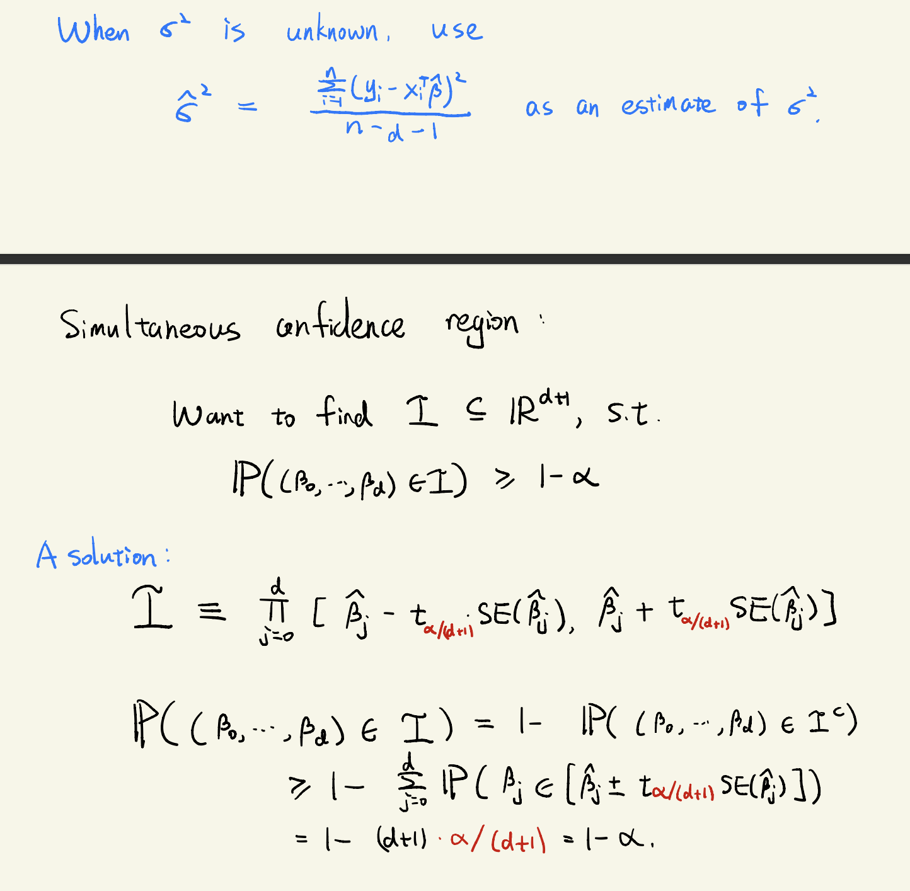
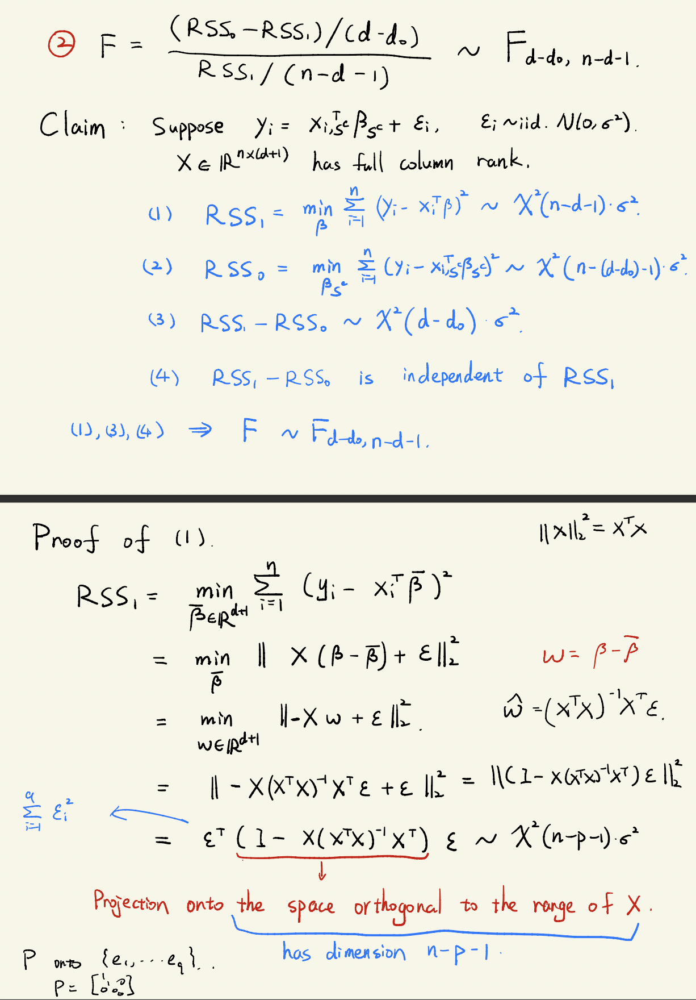

# lec4 Linear Regression II

## Parameter estimation

$$\text{RSS}(\beta) = \sum_{i=1}^n e_i^2 = \sum_{i=1}^n(y_i - x_i^T \beta)^2=||y-X\beta||^2_2$$
$$\nabla_{\beta}\text{RSS}(\beta) = 2X^T(y -X\beta)=0\Rightarrow \hat{\beta} = (X^TX)^{-1}X^Ty \in \mathbb{R}^{d+1}$$

## Confidence interval

$$\hat{\beta} - \beta \sim \mathcal{N}(0, (X^TX)^{-1}\sigma^2)$$

$$\hat{\beta} -\beta =  (X^TX)^{-1}X^T(X\beta + \epsilon) -\beta =(X^TX)^{-1}X^T \epsilon$$

$$E[\hat{\beta}-\beta] = 0$$
$$\operatorname{Var}(\hat{\beta}) = (X^TX)^{-1}X^T(\sigma^2 I)X(X^TX)^{-1}=(X^TX)^{-1}\sigma^2$$

$$\text{SE}(\hat{\beta_j})=\sqrt{(X^TX)_{jj}^{-1}}\sigma, j = 0,1,\dots,d$$

$$I_j = [\hat{\beta_j}-t_{\alpha}\text{SE}(\hat{\beta_j}),\hat{\beta_j}+t_{\alpha}\text{SE}(\hat{\beta_j})]$$
$$t_{\alpha}$$ is such that $$P(\beta_j \in I_j)=1-\alpha$$

## Hypothesis testing

For a subset $$S  \subseteq \{0,1,2,\dots, d\}$$ Is any of the coefficients $$\{\beta_j : j \in S\}$$ non-zero?

Null hypothesis: $$\forall j \in S, \beta_j = 0$$

$$\text{RSS}_1  = \min_{\beta} \sum_{i=1}^n(y_i - x_i^T\beta)^2 $$
The residual sum of square when we fit all $$\beta_j$$

$$\text{RSS}_0 = \min_{{\beta}_{S^c}}\sum_{i=1}^n(y_i - x_{i,S^c}^T \beta_{S^c})^2,S^c = \{0,1,\dots,d\}\backslash S$$

The residual sum of square when we fit only $$\{\beta_j:j\in S^c \}$$

F statistics: $$F = \frac{\frac{\text{RSS}_0-\text{RSS}_1}{d-d_0}}{\frac{\text{RSS}_1}{n-d-1}},d_0 = \text{size of}[d] \backslash S$$

$$F \sim F_{d-d_0,n-d-1}$$

### F distribution(background knowledge)

$$F_{p,q}$$ distribution is the distribution of $$\frac{(Z_1^2 + \dots + Z_p^2)/ p}{(U_1^2 +  \dots + U_q^2)/ q}$$
Where $$Z_1,\dots,Z_p,U_1,\dots,U_q \sim_{iid}\mathcal{N}(0,1)$$

$$\Chi^2(p)$$ distribution is the dist of $$\sum_{i=1}^p Z_i^2$$ where $$Z_1,\dots,Z_p \sim_{iid}\mathcal{N}(0,1)\Rightarrow F_{p,q}$$ is the ration of $$(\frac{\frac{\Chi^2(p)}{p}}{\frac{\Chi^2(q)}{q}})$$

$$t(q)$$ distribution is the distribution of $$\frac{Z_1}{\sqrt{(U_1^2 + \dots + U_q^2)/ q}}$$ where $$Z_1,U_1,\dots,U_q \sim_{iid} \mathcal{N}(0,1)$$

$$t(q) \sim \mathcal{N}(0,1)/\sqrt{\Chi^2(q)/q}$$

$$F_{1,q}$$ has the same dist as $$(t(q))^2$$

